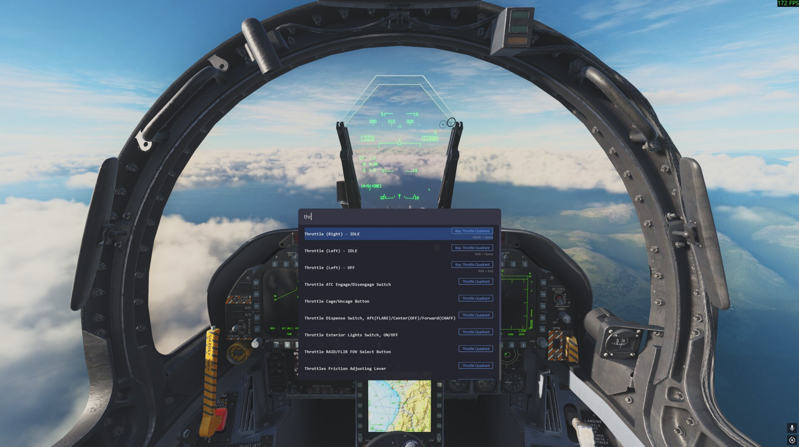
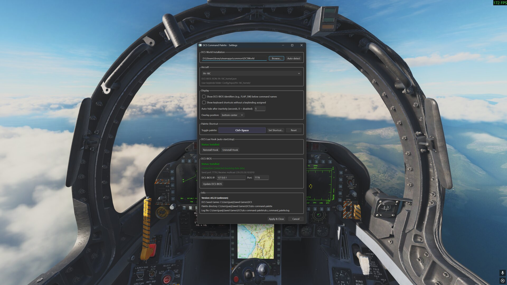
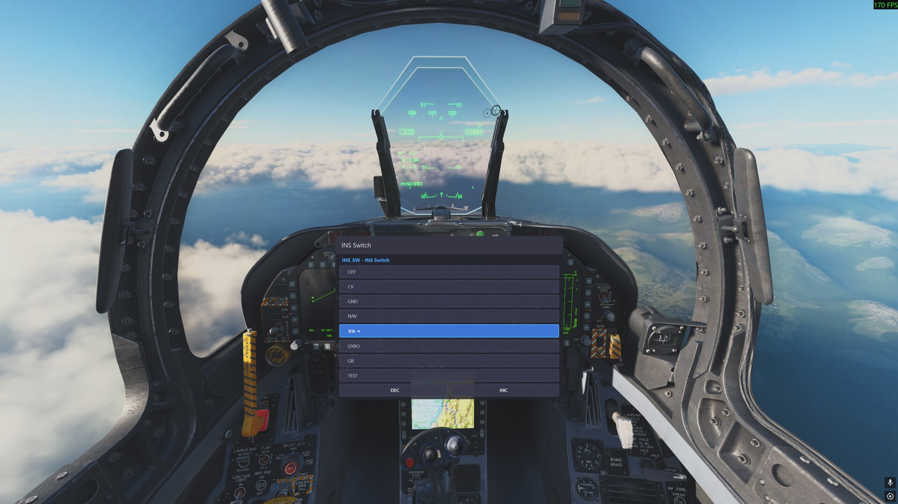

# DCS Command Palette

A VS Code-style command palette for DCS World. Press a hotkey (Ctrl+Space by default, configurable to any keyboard combo or HOTAS button) and a searchable overlay appears over DCS. Type to fuzzy-search all cockpit controls and keyboard shortcuts, then execute them instantly.

## Screenshots





## Features

- **Fuzzy search** across all DCS-BIOS controls and keyboard shortcuts (powered by RapidFuzz)
- **HOTAS button support** -- bind the palette toggle to any joystick button (e.g. `Joy0_Button3`)
- **Auto-starts/stops with DCS** via a Lua hook that detects simulation start/stop
- **Live cockpit state** from DCS-BIOS -- shows current switch positions in the palette
- **Built-in DCS-BIOS installer** in the settings dialog

## Requirements

- DCS World (Steam or standalone)
- DCS-BIOS (can be installed from the Settings dialog)

## Installation

### From Installer (recommended)

1. Download `DCS-Command-Palette-vX.Y.Z-Setup.exe` from the [latest release](https://github.com/juanjux/dcs-command-palette/releases)
2. Run the installer — it will:
   - Install the application to `C:\Program Files\DCS Command Palette` (or your chosen location)
   - Create Start Menu and optional Desktop shortcuts
   - Install the Lua hook to your DCS Saved Games folder (auto-start/stop with missions)
   - Offer to install DCS-BIOS if not already present
3. On first launch, a setup wizard guides you through any remaining configuration
4. After that, the palette starts automatically when you begin a DCS mission

### Manual / Portable

1. Download the latest release ZIP
2. Extract anywhere
3. Run `dcs-command-palette.exe` — the first-run wizard will handle hook installation and DCS-BIOS setup

### From Source (for development)

```bash
cd "Saved Games\DCS"
git clone https://github.com/juanjux/dcs-command-palette
cd dcs-command-palette
python -m venv .venv
.venv\Scripts\pip install -e ".[dev]"
.venv\Scripts\python main.py --aircraft FA-18C_hornet
```

The Lua hook (`src/lua/dcs_command_palette_hook.lua`) will automatically find either the `.exe` or the `.venv\Scripts\pythonw.exe` + `main.py` setup.

## Usage

Once installed, the palette starts automatically with each DCS mission and stops when you exit.

- **Ctrl+Space** (default, configurable): Toggle the command palette overlay
- Type to search, **Up/Down** or **Tab/Shift+Tab** to navigate results, **Enter** to execute
- **Escape**: Close palette or go back from a sub-menu
- Multi-position switches (FLAP, RADAR, ECM, etc.) show a sub-menu with named positions and the **current cockpit state highlighted**
- Dials and knobs show INC/DEC buttons and a slider initialized to the current value
- Unbound keyboard shortcuts are hidden by default (enable in Settings)
- The palette auto-hides after 5 seconds of inactivity (configurable), resets on any interaction

### Built-in Palette Commands

The palette includes several built-in commands (search for them by name):

- **Open Palette Settings** -- opens the configuration dialog
- **Change Aircraft** -- switch to a different aircraft module
- **Restart Palette** -- reload commands and restart the process
- **Exit Palette** -- shut down the palette

## Configuration

Open Settings from the palette (search "settings") or from the system tray icon (right-click).

- **Aircraft**: Auto-detected from DCS on mission start, or manually selected
- **Hotkey**: Keyboard combo (default `Ctrl+Space`) or HOTAS button (e.g. `Joy0_Button3`). Click "Set Shortcut" to capture a new binding
- **Overlay position**: Top, center, or bottom of the screen (useful if TrackIR clips interfere)
- **Auto-hide**: Palette disappears after N seconds of inactivity (default 5, 0 to disable). Resets on interaction
- **Show identifiers**: Toggle DCS-BIOS control IDs (e.g. `FLAP_SW`) below command names
- **Show unbound shortcuts**: Show keyboard shortcuts that have no keybinding assigned (hidden by default)
- **DCS install directory**: Auto-detected or manually selected on first run
- **DCS-BIOS**: Connection status, IP/port configuration, install or update from Settings
- **Lua Hook**: Install/update/uninstall the DCS hook from Settings
- **VR (OpenKneeboard)**: Expose the palette as a web tab inside your VR headset — see below


## VR mode (OpenKneeboard)

The desktop palette overlay doesn't show up inside a VR headset because it's a
regular Windows window. For VR users, the palette can instead run a small
local HTTP server and render inside [OpenKneeboard](https://github.com/OpenKneeboard/OpenKneeboard)
as a web page tab — fully usable via OpenKneeboard's cursor.

**Setup**

1. Install OpenKneeboard from its GitHub releases page. (Settings → VR → *Download OpenKneeboard…* opens the right URL.)
2. Enable VR in DCS as usual. The palette detects `VR.enable = true` from your `options.lua` and starts the web server automatically (default mode: `auto`).
3. In OpenKneeboard, add a new tab of type **Web Page** and paste the URL shown in Settings → VR (default `http://127.0.0.1:7788/`). Click *Copy URL* in Settings for a one-click copy.
4. Switch to that tab while in VR — the palette appears in your headset. Type with OpenKneeboard's virtual keyboard or via your Quest keyboard overlay, click results with the OpenKneeboard cursor.

**VR-specific settings** (Settings → VR)

- **VR web server**: `auto` (start when DCS VR is enabled), `always` (always run), or `off`
- **Port**: 7788 by default — change it if the port is taken
- **Auto-start OpenKneeboard when DCS VR is enabled**: launches OpenKneeboard for you when it detects DCS going into VR mode (only if OpenKneeboard is installed)

**Notes**

- Favorites, usage tracking, and BIOS state are shared between the desktop and VR UIs — they read the same `usage_data.json` and connect to the same DCS-BIOS instance.
- Spring-loaded switches (engine crank, HDG, CRS) work as "tap to engage, tap center to release" in the VR UI, since there's no mouse-hold equivalent with OpenKneeboard's cursor.
- The server only binds to `127.0.0.1`, so it's never accessible from another machine.


## Reporting bugs

Run the .exe or .py (if using the source distribution) with the `--debug` parameter. Try to reproduce the issue and create and
issue on https://github.com/juanjux/dcs-command-palette/issues attaching the dcs_command_palette.log on your `C:\Users\YOURUSER\Saved Games\DCS\dcs-command-palette` directory.


## Development

### Setup

```bash
git clone https://github.com/juanjux/dcs-command-palette
cd dcs-command-palette
python -m venv .venv
.venv\Scripts\pip install -e ".[dev]"
```

### Running tests

```bash
.venv\Scripts\python -m pytest tests/ -v     # all tests
.venv\Scripts\python -m mypy src/             # type checking
```

### Running with debug logging

```bash
.venv\Scripts\python main.py --debug --aircraft FA-18C_hornet
```

### Building the Windows installer

Requires [Inno Setup 6](https://jrsoftware.org/isdl.php) and PyInstaller:

```bash
.venv\Scripts\pip install pyinstaller
.venv\Scripts\python build_installer.py
```

This will:
1. Run PyInstaller to create `dist/dcs-command-palette/` (the standalone .exe + deps)
2. Generate an Inno Setup script and compile it into a single installer

Output: `dist/DCS-Command-Palette-v{version}-Setup.exe`

The installer includes:
- All application files
- Start Menu and optional Desktop shortcuts
- Optional Lua hook installation (auto-detects DCS Saved Games)
- Clean uninstaller (removes hook too)

To build just the .exe without the installer (no Inno Setup needed):

```bash
.venv\Scripts\python build_exe.py
```

### Creating a GitHub release

```bash
# Build the installer
.venv\Scripts\python build_installer.py

# Create the release
gh release create v0.1.0 "dist/DCS-Command-Palette-v0.1.0-Setup.exe" \
    --title "v0.1.0" --notes "Initial release"
```

## Supported Aircraft

Any aircraft with DCS-BIOS support. The palette auto-detects installed modules from the DCS installation directory. Keyboard shortcut parsing works for all standard DCS aircraft.

## License

MIT
